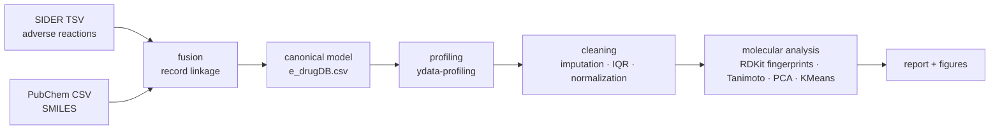

# Pharmacovigilance Data Integration — Do drugs that cause the same adverse reaction share molecular substructure?

A reproducible **data-quality and integration pipeline** that links two heterogeneous pharmacology sources — **SIDER 4.1** (drug → adverse drug reactions, MedDRA terms) and **PubChem** (drug → molecular structure, SMILES) — into a single canonical model, then tests whether drugs sharing an adverse drug reaction (ADR) also share molecular substructure (Morgan/ECFP4 fingerprints + Tanimoto similarity).

> **Honest result (read this first).** The molecular-similarity signal is **weak and partial, not a clean confirmation.** Hepatotoxic drugs do form higher-similarity clusters (Tanimoto > 0.4) and CNS-reaction drugs skew toward lower TPSA (blood–brain-barrier permeability), but globally **molecular structure alone is a poor predictor of ADR profile** (PCA explains only ~9.8% of variance in 2 components; no formal hypothesis test was run — the analysis is exploratory). The durable contribution of this repo is the **reproducible integration + data-quality pipeline and the domain framing**, not a positive predictive claim.

**Domain:** computational pharmacovigilance · **Framework:** TDQM (Total Data Quality Management) · **Course:** Data Quality & Preprocessing, BSc Data Science (IIMAS-UNAM).

---

## Why this matters

Poor data quality in drug-safety data can hide signals that should pull a drug from the market — the canonical example is *rofecoxib* (Vioxx), whose cardiac signal was delayed by fragmented, duplicated, inconsistent reports. This project treats **data quality as the methodological backbone** of a safety question, not an afterthought.

## Data sources

| Source | Content | Format | Link key |
|---|---|---|---|
| **SIDER 4.1** | drug → adverse reaction (MedDRA Preferred Terms) | TSV | PubChem CID (via STITCH flat ID) |
| **PubChem** | drug → molecular structure (SMILES, IUPAC) | CSV via API | PubChem CID |

Key heterogeneity tackled: the *same* drug is named differently across sources ("Aspirin" vs "Acetylsalicylic acid" vs IUPAC), and identifiers differ (SIDER STITCH ID vs PubChem CID).

## Pipeline



| TDQM phase | Script | Output |
|---|---|---|
| Define | `README` / spec | 5 business problems, quality dimensions, metrics |
| Measure | `src/03_profiling.py` | profile **before** cleaning, baseline metrics |
| Analyze | `src/05_analysis.py` | 24 cross-source + molecular figures |
| Improve | `src/04_cleaning.py` | `e_drugDB_clean.csv`, profile **after** cleaning |

## Key numbers

- **152,759** drug–reaction pairs · **1,556** unique drugs · **4,251** unique MedDRA reactions (final canonical model).
- **Semantic heterogeneity quantified:** 53.9% of drugs have Jaro-Winkler < 0.50 between SIDER name and IUPAC name.
- **Deduplication:** 10,447 duplicate pairs removed (6.4%) — STITCH stereoisomer artifact resolved at base-CID level.
- **Severity imputation:** coverage 0% → 41.4% (from MedDRA frequency data).
- **SMILES accuracy:** 100% parseable/sanitizable by RDKit (0 invalid).
- **Molecular method:** Morgan fingerprints (ECFP4, radius 2, 1024 bits), Tanimoto similarity, PCA, KMeans (k=5).

Headline figures in `reports/figures/`: `D1_tanimoto_hepatotoxicidad.png`, `D2_tanimoto_por_reaccion.png`, `D3_pca_fingerprints.png`, `D4_kmeans_fingerprints.png`, `C9_tpsa_neuro_vs_otros.png`.

## Reproduce

```bash
python -m venv .venv && source .venv/bin/activate
pip install -r requirements.txt          # numpy pinned to 2.3.4 (numba/ydata-profiling compat)
python src/01_download.py                 # fetch SIDER TSVs + PubChem SMILES
python src/02_fusion.py                   # build canonical model (record linkage + merge)
python src/03_profiling.py                # profile before & after
python src/04_cleaning.py                 # imputation, IQR, normalization
python src/05_analysis.py                 # 24 figures (A/B/C/D)
```

> Raw and processed data (~140 MB) are **not** committed — regenerate them with the scripts above. A small inspection sample lives in `data/sample/`. See `.gitignore`.

## Repository layout

```
.
├── README.md · LICENSE · requirements.txt · .gitignore
├── data/        raw/ clean/ (gitignored, regenerated) · sample/ (committed)
├── src/         01_download → 05_analysis
├── sql/         schema.sql · analysis_queries.sql · views.sql
├── notebooks/   pipeline_maestro.ipynb
├── reports/     reporte_final.pdf · figures/ (24 PNGs)
└── docs/        data_dictionary.md
```

## SQL analysis layer

The cleaned canonical model also loads into a relational table for SQL analysis
(`sql/schema.sql`). `sql/analysis_queries.sql` contains analytical queries —
CTEs, window functions (`RANK() OVER (PARTITION BY …)`, share-of-total), self/aggregations,
duplicate detection, drug–reaction frequency, and molecule-level safety exploration —
tested on the full 152,759-row dataset in both PostgreSQL and SQLite. `sql/views.sql`
exposes reusable `v_reaction_summary` and `v_drug_summary` views.

```bash
sqlite3 pv.db ".read sql/schema.sql" \
  ".mode csv" ".import --skip 1 data/clean/e_drugDB_clean.csv drug_reactions" \
  ".read sql/analysis_queries.sql"
```

## Limitations & ethics

- Exploratory analysis, **no formal statistical test** (subgroup sizes per ADR vary widely; power is heterogeneous).
- SIDER reflects label/post-market data, not incidence — absence of an ADR ≠ safety.
- Not for clinical decision-making. Educational / methodological project.

## Tech stack

`pandas` · `numpy==2.3.4` · `recordlinkage` · `thefuzz` + `python-Levenshtein` · `rdkit` · `ydata-profiling` · `scikit-learn` · `matplotlib` · `seaborn` · `plotly`

## Citation

Cruz Gutiérrez, E. O. (2026). *Pharmacovigilance Data Integration: molecular substructure and shared adverse drug reactions.* BSc Data Science final project, IIMAS-UNAM.

Sources: SIDER 4.1 (Kuhn et al., 2016) · PubChem (Kim et al.) · Morgan/ECFP fingerprints (Rogers & Hahn, 2010).

## License

MIT — see `LICENSE`. SIDER and PubChem retain their own licenses; this repo distributes code, not their raw data.
